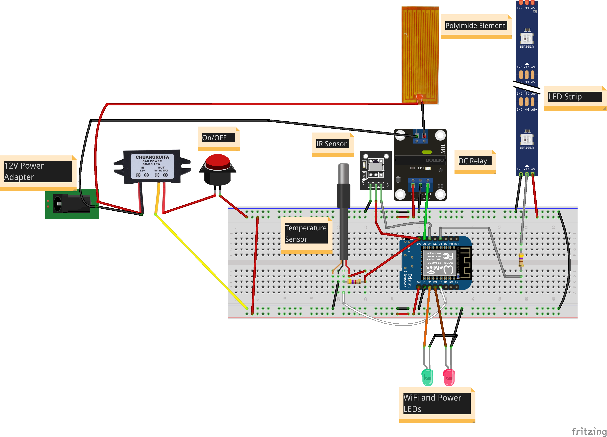

<p align="center">
  <a href="" rel="noopener">
 </a>
</p>

<h3 align="center">Smart Wax Melter</h3>

<div align="center">

[]()
[](https://github.com/kylelobo/The-Documentation-Compendium/pulls)

</div>

---


<p align="center"> Few lines describing your project.
    <br> 
</p>

## 📝 Table of Contents

- [About](#about)
- [Getting Started](#getting_started)
- [Deployment](#deployment)
- [Usage](#usage)
- [Test](#test)
- [Built Using](#built_using)
- [Circuit](#circuit)
- [Contributing](../CONTRIBUTING.md)
- [Authors](#authors)


## 🧐 About <a name = "about"></a>

This repo contains circuit, firmware and backend for SmartWaxMelter Project.

## 🏁 Getting Started <a name = "getting_started"></a>

These instructions will get you a copy of the project up and running on your local machine for development and testing purposes. See [deployment](#deployment) for notes on how to deploy the project on a live system.

### Prerequisites

What things you need to install the software and how to install them.

```
- Arduino IDE
- Ubuntu Server 20.04
```

### Installing

A step by step series that tell you how to get the Firmware and Backend running

#### WemosD1 Mini Fimrware

You should have Arduino IDE Installed

  1.  Add ESP8266 Board to your Arduino IDE
    1. In your Arduino IDE, go to File> Preferences
        Installing ESP8266 Add-on in Arduino IDE Windows, Mac OS X, Linux open preferences
    2. Enter ```http://arduino.esp8266.com/stable/package_esp8266com_index.json``` into the “Additional Board Manager URLs” field then, click the “OK” button:
    Note: if you already have the ESP32 boards URL, you can separate the URLs with a comma as follows:
    ```https://dl.espressif.com/dl/package_esp32_index.json,
      http://arduino.esp8266.com/stable/package_esp8266com_index.json```
    3. Open the Boards Manager. Go to Tools > Board > Boards Manager…
    4. Search for ESP8266 and press install button for the ESP8266 by Espressif Systems“:
    5. That’s it. It should be installed after a few seconds.

  2.  Now copy the contents of the libs folder to the libraries directory of your Arduino
    1. If you are using windows, the libraries directory will be Documents/Arduino/libraries
  3.  Select LOLIN(WEMOS) D1 R2 & mini from Tools->Board->ESP8266
  4.  Select the correct port from Tools->Port
  5.  Then in Fimrware.ino file, on line number 12 and 13, put your WiFi creds
  6.  Upload the Code to your WEMOS Board
  7.  Open the serial monitor on your Arduino IDE and press reset button on your Wemos Board. Then note down the Mac Address value.

  ```diff
  + broker used is borker.hivemq.com
  ```
  Note: The topics are arranged as SmartWaxMelter/MacAddressOfBoard/temperature etc.


## 🔧 Circuit Diagram <a name = "circuit"></a>

Complete Circuit Diagram of Sensor Node



## 🎈 Usage <a name="usage"></a>

[Will be updated]

## Test <a name="test"></a>

- Install MQTTLens which is a chrome extension from the link below
- https://chrome.google.com/webstore/detail/mqttlens/hemojaaeigabkbcookmlgmdigohjobjm?hl=en
- Now open MQTTLens, click on '+' button next to 'Connections' on top left corner
- In connection name add 'HiveMQ', in hostname add 'broker.hivemq.com' and then scroll down and click 'CREATE CONNECTION'   button
- Now in Subscribe section put ```SmartWaxMelter/MacAddress/temperature```(replace MacAddress with the MacAdress value noted down in WemosD1 Mini Fimrware section point 7) and click 'SUBSCRIBE' button next to it.
- Restart your Wemos by pressing RST button on your Wemos
- once done, you will see data comming from Wemos to MQTTLens and when you press the buzzer button, you will see the MQTTLens log will show the live temperature values.
1. You can also control the relay or the RGB Led strip
  1. In the publish section publish "on" or "off" to the topic ```SmartWaxMelter/MacAddress/relay```
  2. Publish "r,g,b,brightness" replace r,g,b,brightness with the values from 1 to 255 for example "20,34,66,100" to the topic ```SmartWaxMelter/MacAddress/ledStrip```


## 🚀 Deployment <a name = "deployment"></a>

Add additional notes about how to deploy this on a live system.
[will be updated]

## ⛏️ Built Using <a name = "built_using"></a>

- [Fritzing](https://fritzing.org/) - Circuit Design
- [Arduino](https://www.arduino.cc/) - IDE
- [VueJs](https://vuejs.org/) - Web Framework
- [NodeJs](https://nodejs.org/en/) - Server Environment

## ✍️ Authors <a name = "authors"></a>

- [@Nauman3S](https://github.com/Nauman3S) - Development and Deployment

